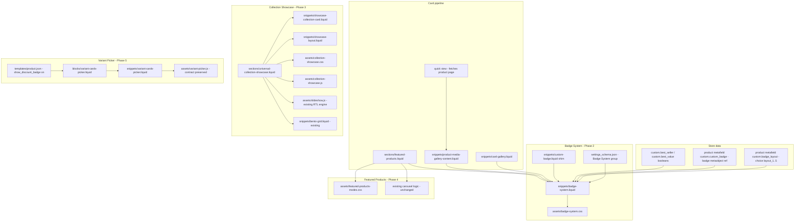

# Almoallem Theme Refactor — Deliverables Index

Store: **Al Moallem Mill** (almoallemmill.com, Kuwait, KWD, AR/EN).
Target theme: **Copy of Copy of v4** — `gid://shopify/OnlineStoreTheme/187213774882` (unpublished).
Every theme change in this folder's reports was uploaded via the Shopify Admin
GraphQL API and verified by MD5 checksum against the mirror in `almoallem-theme/`.

## Architecture overview

## Reports

| Phase | Report | Status |
|-------|--------|--------|
| Conventions | `conventions-brief.md` (distilled from repo skills: motion-ui, liquid-glass-design, frontend-a11y, design-system, …) | binding contract for all phases |
| 1 — Bundle Builder removal | `phase1-bundle-cleanup.md` | 14 files neutralized + page.json cleaned; store data deliberately kept (live v4 dependency) with ready-to-run cleanup mutations |
| 2 — Badge System | `phase2-badge-system.md` | 5 layouts, 9 animation presets, metafield dropdown fixed, all surfaces covered |
| 3 — Collection Showcase | `phase3-collection-showcase.md` | 9 layout modes on the existing slideshow engine, on homepage with real collections |
| 4 — Featured Products | `phase4-featured-products.md` | +4 layout modes, badges on cards, 12 new settings, zero-regression defaults |
| 5 — Variant picker | `phase5-variant-picker.md` | discount row + −NN% chip, per-option grouping (cards + pills), JS contract verified |
| Merchant guide | `merchant-guide.md` | bilingual EN/AR usage guide |
| Removed files archive | `removed-bundle-files/` | original bundle templates pre-deletion |

## Cross-cutting guarantees

- **RTL/LTR**: logical properties only in all new CSS; carousel/swipe/keyboard
  inherited from the theme's RTL-aware slideshow engine; directional glyphs
  mirrored under `[dir="rtl"]`; `<bdi>` used for the discount chip.
- **Translations**: every new user-facing string uses `t:` keys present in BOTH
  `locales/en.default.json` and `locales/ar.json` (badge texts, showcase
  strings, price-on-selection placeholder, aria labels).
- **Accessibility**: fieldset/legend option groups, aria-labels on carousel
  controls from locale keys, focus-visible styles, ≥44px mobile touch targets,
  scrim setting for text-over-image contrast, visually-hidden price labels.
- **Performance**: lazy loading, `content-visibility: auto` virtualization,
  transform/opacity-only animations, IntersectionObserver (no scroll
  listeners), no new libraries, reveal effects no-JS-safe.
- **Reduced motion**: every animation suite has a `prefers-reduced-motion`
  kill-switch (transforms killed, autoplay paused, ≤200ms opacity only).
- **Mobile**: independent mobile layout/columns/width/animation settings in
  showcase + featured products; badge mobile size/visibility controls.

## Post-publish cleanup (manual, documented in phase 1 report)

1. Delete the 14 neutralized bundle stub files in the code editor.
2. Run the recorded `metaobjectDefinitionDelete` / `metafieldDefinitionDelete`
   mutations to drop Bundle Builder store data once no published theme uses it.
