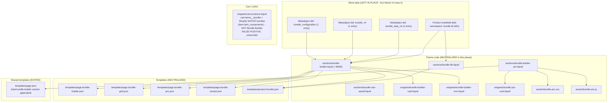

# Phase 1 — Bundle Builder Removal (Al Moallem Mill)

Date: 2026-06-11
Theme: "Copy of Copy of v4" — `gid://shopify/OnlineStoreTheme/187213774882` (UNPUBLISHED)
Store: almoallemmill.com
Local mirror: `almoallem-theme/` (repo reflects final theme state)
Archived bundle templates (pre-removal contents): `docs/almoallem/removed-bundle-files/`

## 1. Dependency graph



Plain-text fallback:

```
Bundle Builder feature
├── Store data (kept; live v4 theme still consumes it)
│   ├── Product metafields, namespace "bundle": enable_bundle_builder, bundle_eligibility,
│   │   bundle_priority, bundle_category, badge, exclude_from_bundle,
│   │   bundle_image_override, bundle_price_override
│   └── Metaobjects: bundle_configuration (1), bundle_v4 (1), bundle_step_v4 (1)
├── Sections: bundle-builder.liquid (~66KB), bundle-builder-pro.liquid,
│   bundle-cart-upsell.liquid, bundle-fbt.liquid
│   ├── Snippets: bundle-builder-card, bundle-builder-icon, bundle-pro-card
│   └── Assets: bundle-pro.css, bundle-pro.js
├── Templates referencing the sections:
│   ├── page.bundle-builder.json, page.bundle-grid.json, page.bundle-wizard.json (bundle-builder + collection/faq/main-page)
│   ├── page.bundle-pro.json (bundle-builder-pro)
│   ├── product.bundle.json (bundle-builder + bundle-fbt + product-recommendations)
│   └── page.json — generic page template had a "bundle_builder_Hw3ren" section appended (EDITED OUT)
├── Cart/AJAX: NONE. cart-products.liquid `cart-items__bundle` is stock Horizon markup for
│   Shopify NATIVE bundles (item.item_components) — left untouched.
└── Theme settings: NONE. No bundle keys in settings_data.json / settings_schema.json,
    no bundle script/style tags in theme.liquid / scripts.liquid / stylesheets.liquid,
    no bundle translation keys in locales/en.default.json or locales/ar.json.
```

## 2. Files removed (neutralized to inert stubs)

IMPORTANT DEVIATION: the MCP proxy blocks `themeFilesDelete` outright (category
"destructive", matched `themeFilesDelete` — even for unpublished themes). All 14 files were
instead **overwritten with inert stubs** via `themeFilesUpsert`. The Bundle Builder is
functionally removed (no bundle code can render), but the stub files still exist and must be
deleted manually in Shopify admin → Online Store → Themes → "Copy of Copy of v4" → Edit code,
or via Shopify CLI (`shopify theme pull/push`) once Phase-final cleanup happens.

| Path | Original size | Role | Current state |
|---|---|---|---|
| `assets/bundle-pro.css` | not captured | Styles for Bundle Builder Pro | stub comment |
| `assets/bundle-pro.js` | not captured | JS for Bundle Builder Pro | stub comment |
| `sections/bundle-builder.liquid` | ~66 KB (reported) | Main bundle builder section | stub w/ empty schema "[Removed] Bundle builder", no presets |
| `sections/bundle-builder-pro.liquid` | not captured | "Pro" bundle builder variant | stub "[Removed] Builder pro" |
| `sections/bundle-cart-upsell.liquid` | not captured | Bundle upsell in cart | stub "[Removed] Cart upsell" |
| `sections/bundle-fbt.liquid` | not captured | Frequently-bought-together bundles | stub "[Removed] Bundle FBT" |
| `snippets/bundle-builder-card.liquid` | not captured | Product card used by builder | stub comment |
| `snippets/bundle-builder-icon.liquid` | not captured | Icon snippet | stub comment |
| `snippets/bundle-pro-card.liquid` | not captured | Card for pro builder | stub comment |
| `templates/page.bundle-builder.json` | 5,768 B | Page template: builder + collection + faq | stub → `main-page` only |
| `templates/page.bundle-grid.json` | 2,410 B | Page template: builder grid layout | stub → `main-page` only |
| `templates/page.bundle-pro.json` | 1,385 B | Page template: bundle-builder-pro | stub → `main-page` only |
| `templates/page.bundle-wizard.json` | 2,509 B | Page template: builder wizard layout | stub → `main-page` only |
| `templates/product.bundle.json` | 919 B | Product template: builder + FBT + recs | stub → `product-information` only |

Original contents of the five templates are archived in
`docs/almoallem/removed-bundle-files/`. The large section/asset originals were deliberately
not downloaded (per instructions); their stubbed state is recoverable from theme version
history in Shopify admin if ever needed.

Note: section stubs keep a minimal valid `` (Shopify requires one) with no
presets, so they cannot be added from the theme editor and render nothing. Template stubs
were normalized by Shopify on upsert (standard auto-generated header + `"settings": {}`);
the mirror matches the normalized server state byte-for-byte.

## 3. Reference edits

| File | Change | Upserted |
|---|---|---|
| `templates/page.json` | Removed section `"bundle_builder_Hw3ren"` (type `bundle-builder`, name "Bundle Builder") from `sections` and removed `"bundle_builder_Hw3ren"` from `order`. This was appended to the **generic page template**, so every plain page was rendering the bundle builder. Nothing else changed. | yes, verified byte-exact |

No other references existed. Audited (grep, case-insensitive: `bundle`, `bundle-pro`,
`bundle-builder`, `bundle_v4`, `bundle-fbt`, `bundle-cart-upsell`) across:
`layout/theme.liquid`, `snippets/{scripts,stylesheets,cart-products,cart-summary,cart-drawer}.liquid`,
`config/settings_{data,schema}.json`, all 15 standard templates, `sections/{header-group,footer-group}.json`,
`sections/2products.liquid`, all 4 `blocks/ai_gen_block_*.liquid`, `locales/{en.default,ar}.json`.

False positive (left untouched): `snippets/cart-products.liquid` lines 190 and 541 —
CSS class `cart-items__bundle` rendering `item.item_components`. This is stock Horizon-theme
support for **Shopify native bundles** (component line items), unrelated to the Bundle
Builder feature.

## 4. Store-level data deliberately left in place

Reason: the **LIVE theme "v4" still reads these**. Deleting them now would break the live
storefront. Remove only after the cleaned theme is published and verified.

Metaobject definitions (deleting a definition also deletes its entries):

| Type | Name | Entries | Definition ID |
|---|---|---|---|
| `bundle_configuration` | Bundle Configuration | 1 | `gid://shopify/MetaobjectDefinition/19492601890` |
| `bundle_v4` | Bundle V4 Configuration | 1 | `gid://shopify/MetaobjectDefinition/21227110434` |
| `bundle_step_v4` | Bundle Step | 1 | `gid://shopify/MetaobjectDefinition/21227208738` |

Product metafield definitions, namespace `bundle`:

| Key | Name | Type | Definition ID |
|---|---|---|---|
| `enable_bundle_builder` | Enable Bundle Builder | boolean | `gid://shopify/MetafieldDefinition/238754234402` |
| `bundle_eligibility` | Bundle Eligibility | single_line_text_field | `gid://shopify/MetafieldDefinition/238754267170` |
| `bundle_priority` | Bundle Priority | number_integer | `gid://shopify/MetafieldDefinition/238754299938` |
| `bundle_category` | Bundle Category | single_line_text_field | `gid://shopify/MetafieldDefinition/238754332706` |
| `badge` | Bundle Badge | single_line_text_field | `gid://shopify/MetafieldDefinition/238754365474` |
| `exclude_from_bundle` | Exclude from Bundle | boolean | `gid://shopify/MetafieldDefinition/238754398242` |
| `bundle_image_override` | Bundle Image Override | file_reference | `gid://shopify/MetafieldDefinition/238754431010` |
| `bundle_price_override` | Bundle Price Override | money | `gid://shopify/MetafieldDefinition/238754463778` |

### Post-publish cleanup mutations (run AFTER the cleaned theme is live and verified)

Metaobject definitions (also deletes the entries):

```graphql
mutation {
  d1: metaobjectDefinitionDelete(id: "gid://shopify/MetaobjectDefinition/19492601890") { deletedId userErrors { field message } }
  d2: metaobjectDefinitionDelete(id: "gid://shopify/MetaobjectDefinition/21227110434") { deletedId userErrors { field message } }
  d3: metaobjectDefinitionDelete(id: "gid://shopify/MetaobjectDefinition/21227208738") { deletedId userErrors { field message } }
}
```

Metafield definitions (with `deleteAllAssociatedMetafields: true` to purge product values):

```graphql
mutation {
  m1: metafieldDefinitionDelete(id: "gid://shopify/MetafieldDefinition/238754234402", deleteAllAssociatedMetafields: true) { deletedDefinitionId userErrors { field message } }
  m2: metafieldDefinitionDelete(id: "gid://shopify/MetafieldDefinition/238754267170", deleteAllAssociatedMetafields: true) { deletedDefinitionId userErrors { field message } }
  m3: metafieldDefinitionDelete(id: "gid://shopify/MetafieldDefinition/238754299938", deleteAllAssociatedMetafields: true) { deletedDefinitionId userErrors { field message } }
  m4: metafieldDefinitionDelete(id: "gid://shopify/MetafieldDefinition/238754332706", deleteAllAssociatedMetafields: true) { deletedDefinitionId userErrors { field message } }
  m5: metafieldDefinitionDelete(id: "gid://shopify/MetafieldDefinition/238754365474", deleteAllAssociatedMetafields: true) { deletedDefinitionId userErrors { field message } }
  m6: metafieldDefinitionDelete(id: "gid://shopify/MetafieldDefinition/238754398242", deleteAllAssociatedMetafields: true) { deletedDefinitionId userErrors { field message } }
  m7: metafieldDefinitionDelete(id: "gid://shopify/MetafieldDefinition/238754431010", deleteAllAssociatedMetafields: true) { deletedDefinitionId userErrors { field message } }
  m8: metafieldDefinitionDelete(id: "gid://shopify/MetafieldDefinition/238754463778", deleteAllAssociatedMetafields: true) { deletedDefinitionId userErrors { field message } }
}
```

Also at that time: delete the 14 stub theme files in admin → Edit code, and check whether any
store **pages** are still assigned to the `page.bundle-*` templates / products to
`product.bundle` (reassign to default templates before deleting the stub templates).

## 5. ai_gen_block_* findings (all UNRELATED to Bundle Builder — kept)

| File | What it is |
|---|---|
| `blocks/ai_gen_block_6fb1569.liquid` | "Luxury banner" — premium full-width banner block (image/color bg, overlay, RTL support) |
| `blocks/ai_gen_block_84b2acb.liquid` | "Hero banner" — hero with bg image/video, overlay, two buttons, RTL |
| `blocks/ai_gen_block_9d90825.liquid` | "Featured products" — advanced featured-products block, RTL-first |
| `blocks/ai_gen_block_d95097b.liquid` | "Featured Products" grid + carousel, with AJAX add-to-cart / cart-drawer section re-render |

Zero `bundle` mentions in any of them. Relevant to later phases: the two banner blocks and
two featured-products blocks overlap functionally — candidates for consolidation, not Phase 1.

## 6. Verification results

- All 14 bundle files re-downloaded after stubbing: content matches mirror byte-for-byte
  (stubs confirmed live on theme). They are NOT deleted — see deviation note in §2.
- `templates/page.json` re-downloaded: byte-identical to mirror; valid JSON; only `main` in
  `sections`/`order`.
- All mirror JSON files parse (Shopify `/* */` headers and `//` locale comments stripped for
  the check; mirror keeps original bytes — note `locales/en.default.json` contains `//`
  comments as stored in the theme).
- Residual reference grep over the mirror for `bundle-builder|bundle-pro|bundle-fbt|bundle-cart-upsell|bundle_v4`:
  zero hits outside the stub files themselves. Only remaining `bundle` mention is the native-
  bundles markup in `snippets/cart-products.liquid` (intentional).
- Locales re-downloaded during verification and matched the mirror (no bundle translation keys
  existed in either locale).
- No other theme, no products/pages/collections, and no store-level definitions were touched.
